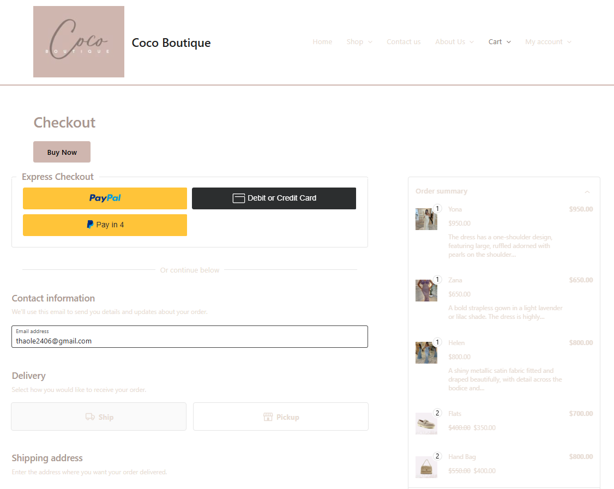

# wordpress_coco_boutique

I built an e-commerce website for Coco Boutique using Wordpress. Based on customers' requirements, I created functionalities of this business website such as product catalog, shopping cart & checkout, product search & filters (WooCommerce), product pages (Image Gallery & sliders), user account & registration (Simple Membership plugin), SEO optimization, social media integration (Elementor plugin), email marketing integration (Mail Chimp plugin), analytics integration (Google analytics plugin), security (Sucuri plugin).

Following are some screenshots from the website

## Coco boutique homepage

## New arrival page

## About page

## Checkout page

